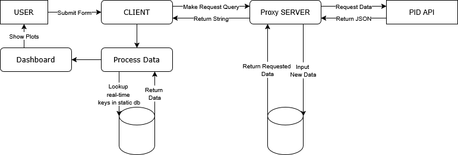
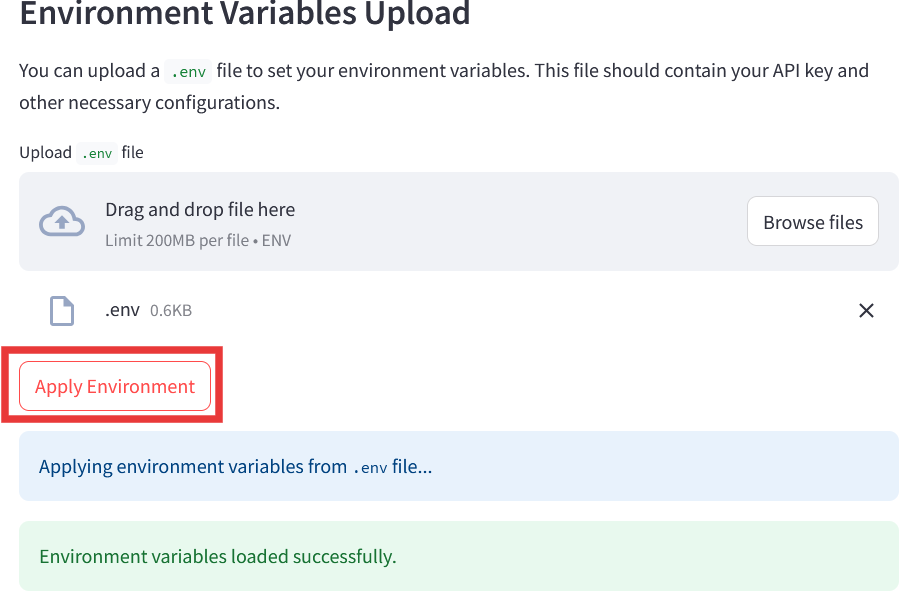
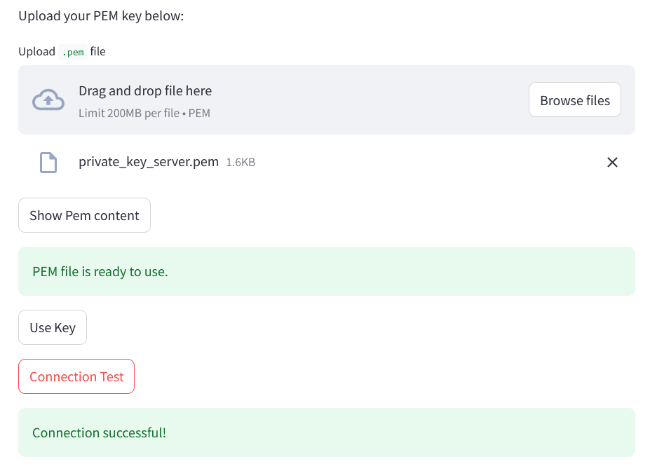
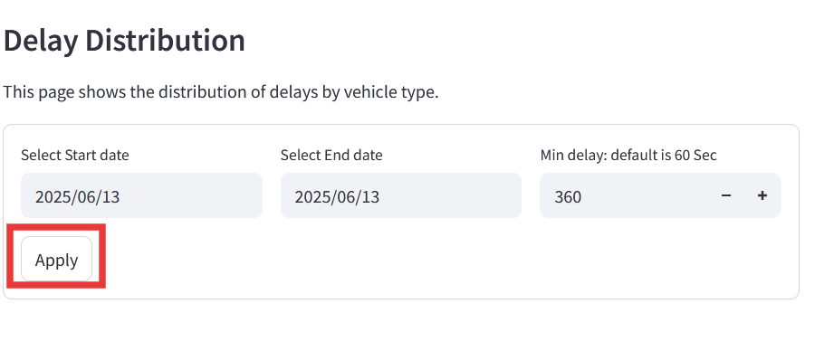
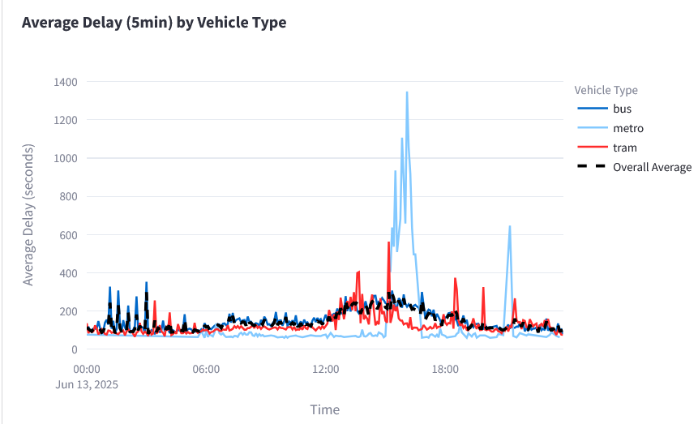
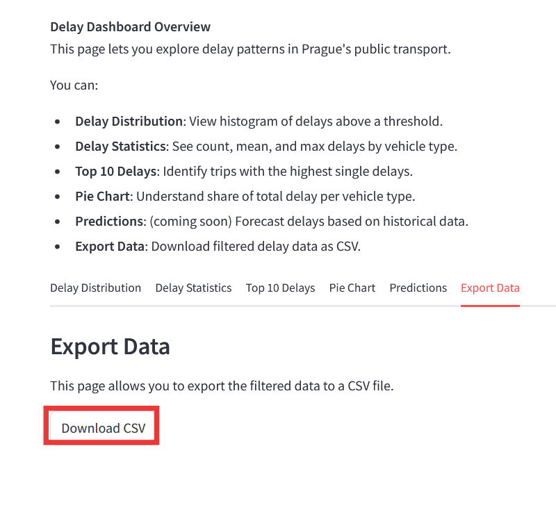

# Vehicle Positions API Project
By Nils Wüstefeld and Adam Pasalek


##  Prague Transit Delay Dashboard

This Streamlit application visualizes public transport delays in Prague, using data from the Prague Integrated Transport Authority (Pražská integrovaná doprava, PID). It provides interactive dashboards and analytics tools for exploring real-time and historical delay data.

The app features two main dashboards:

- **Trip Dashboard** – Displays delays at the level of individual trips and vehicle types.
- **Stop Dashboard** – Focuses on delays occurring at specific stops.

These tools can help users:

- Analyze the performance of specific transit lines.
- Identify bottlenecks in the transport network.
- Discover patterns in delays over time and across locations.


### Contribution Breakdown

   This project was developed collaboratively. Below is a summary of individual contributions:

   **Nils**  
   Developed the core application logic and backend infrastructure. This includes:
   - App structure and layout
   - Database design and management
   - Proxy server and REST API integration
   - Request handling and authentication
   - Trips dashboard and analytics
   - Heatmap visualization of delays

   **Adam**  
   Focused on Stops dashboard, documentation and frontend usability, including:
   - Stops dashboard and analytics
   - Writing descriptive content and explanations
   - Enhancing UI/UX elements
   - Structuring pages and layout styling
   - Assisting with testing and user interaction improvements
   - Project documentation


## Data Flow
To fetch the historic delays a proxy fetching server is obtaining the current delays for every minute and updates its database accordingly.




## Setup Instructions

### Requirements

   To run this project, you need to install the required Python dependencies and obtain the `.env` file and `server key` from the admin.
   These dependencies are listed in the `requirements.txt` file. You can install them using `pip`:

   1. **Create a Virtual Environment** (if you don't have one already):

      ```bash
      python -m venv venv
      ```

   2. **Activate the Venv**
      ### Linux
      ```bash
      source venv/bin/activate
      ```
      
      ### Windows (Powershell)
         ```powershell
         venv\Scripts\Activate.ps1
         ```

      ### Windows (cmd)
         ```cmd
         venv\Scripts\activate.bat
         ```

   3. **Install the requirements**
         ```bash
         pip install -r requirements.txt
         ```

   4. **Get Enviroment file .env and .pem from the admin or optionally build your own**: the .env file should look like this:
      ```bash
      API_KEY=your_api_key_here
      API_URL=https://your-api-url.com/endpoint
      SERVER_ADRESS = "12345.123"
      USER = "your proxy server username"
      ```
   5. **Run with Streamlit**:
      ```bash
      python -m streamlit run main.py

      ```
## Start the Application
   After running the application, you will land on the landing page.
   This page serves as the home page for the application and gives a broad overview of all functions.

   **Note:**
   If the app is a little slow on the first launch, restarting the app often helps


   From there navigate to the **connection** page and upload the environment file and the private key for the proxy server and API endpoint.

## Connection
   First upload the environment .env and press "Apply Enviroment" to update the settings with the data from the env.

   


   In the second step you upload the .pem private key for the proxy server connection to enable realtime fetiching.
   After upload, press "Use Key" to update the Apps settings.
   Optionally you can check the keys validity with a key check.

   


   If you're currently developing the app and have the .env and right private key in your apps folder, you can switch to "developer mode" and skip the uploads.

   
   After uploading you credentials, you can either go back to the landing page to update the internal database of the App or view the Dashboard and the Stops

## Sample Usage


   1. Navigate to the **Dashboard** or **Stops** page.
   2. Select a **timeframe** and set a **minimum delay** threshold (default = 60 seconds).
   3. Press **Apply** to start the analysis.

   **Note:**  
   The duration for loading data depends on current server load and the number of delay entries being fetched.  
   If the loading feels slow, consider increasing the minimum delay to reduce the data volume
   

   

   After pressing apply, the Client will send a request to the proxy server and will visualize you data

   For example:

   

   If you want to conduct further analysis with the data, you can simply export it on the **Export Data* tab

   


   
